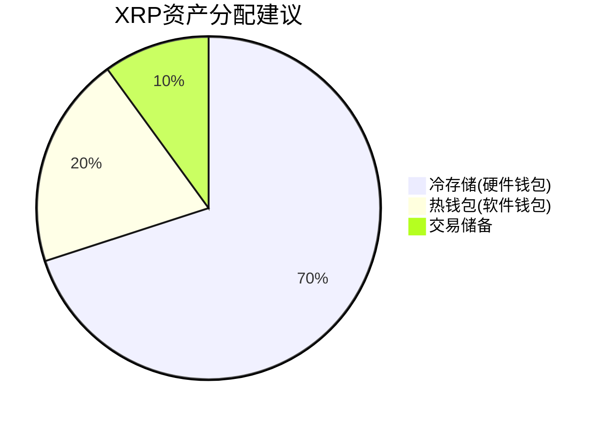

```markdown
# 2025年七大必选XRP钱包：安全存储与交易指南

在加密货币领域，XRP作为金融科技领域的明星资产，其独特的技术架构和跨境支付应用场景持续吸引投资者关注。选择专业级XRP钱包不仅关乎资产安全，更是实现价值增长的关键环节。本文将系统解析当前市场主流钱包方案，助您构建完整的数字资产管理生态。

## XRP钱包的核心价值定位

### 区块链技术特性解析
XRP区块链（XRPL）采用独特的共识机制，在交易速度（3-5秒确认）、成本（0.00001 XRP单笔费用）和网络容量（每秒处理1500笔交易）三大指标上表现优异。这种技术优势使其成为跨境支付领域的标杆解决方案。

### 市场动态观察
截至2024年底，XRP市值稳居加密货币前十，日均交易量突破20亿美元。其独特的"燃烧机制"（每笔交易销毁部分XRP）使供应量呈现自然缩减趋势，为长期持有者创造稀缺性价值。

## 2025年主流XRP钱包方案对比

### 交易所级解决方案
👉 [专业交易平台提供的一站式服务](https://bit.ly/okx_welcome)
1. **Coinbase**：美国合规交易所标杆，支持法币直充，需完成KYC认证
2. **Binance**：全球最大交易平台，提供0.1%超低手续费及丰富交易对
3. **eToro**：多资产投资平台，集成社交交易功能，适合跨市场投资者

### 硬件存储方案
| 型号         | 安全等级 | 操作系统支持 | 特色功能                  |
|--------------|----------|--------------|---------------------------|
| Trezor Model One | ★★★★☆    | Windows/Mac  | 支持1000+币种，基础款推荐 |
| Trezor Model T  | ★★★★★    | 全平台       | 触控屏操作，隐私增强功能  |

### 软件钱包新势力
- **Coinomi**：开源架构，支持Web3生态，跨平台无缝衔接
- **XRP Paper Wallet**：物理存储方案，适合长期持有者

## 钱包选择决策矩阵

### 安全性评估维度
1. **私钥管理方式**：区分托管型与自主控制型
2. **多重验证机制**：2FA、生物识别等技术应用
3. **恢复系统**：助记词备份与灾难恢复方案

### 功能性需求匹配
- **交易频率**：高频交易者需选择API接口完备的方案
- **资产组合**：多币种持有者优先考虑兼容性强的钱包
- **增值功能**：质押、DeFi接入、NFT支持等扩展需求

## 数字资产管理进阶策略

### 资产配置黄金比例


### 质押收益优化方案
通过Binance等平台参与灵活质押，年化收益可达1.4%-2.8%。建议采用复利模式，通过收益再投资加速资产增长。

## 常见问题解答

**Q：XRP钱包是否需要持续联网？**
A：硬件钱包离线存储更安全，软件钱包需联网进行交易确认。建议重要资产采用冷存储方案。

**Q：如何防范钱包私钥泄露风险？**
A：采用物理介质备份（如金属密钥盘）、启用生物识别验证、定期进行安全审计。

**Q：硬件钱包价格差异如何选择？**
A：预算有限可选Trezor Model One，重视隐私保护则推荐Model T，其集成的匿名交易功能值得投资。

**Q：软件钱包是否适合大额存储？**
A：建议不超过总资产20%，优先选择开源代码、社区验证的钱包方案。

**Q：如何实现跨平台资产联动？**
A：使用Coinomi等支持多链的钱包，通过统一账户体系管理分散资产。

## 未来趋势展望
随着XRPL生态的持续扩展，XRP钱包正向三个维度进化：
1. **智能合约集成**：支持定制化支付协议
2. **CBDC兼容**：搭建法币与加密货币的互通桥梁
3. **量子安全防护**：前瞻性防御未来技术风险

在数字金融时代，选择优质XRP钱包如同为资产配置保险箱。通过科学的存储策略与智能工具结合，投资者既能保障基础安全，又能充分挖掘XRP的增值潜力。建议建立动态评估机制，每季度审视钱包方案与市场变化的匹配度，实现数字资产的稳健增长。

👉 [立即探索专业级资产管理方案](https://bit.ly/okx_welcome)
```