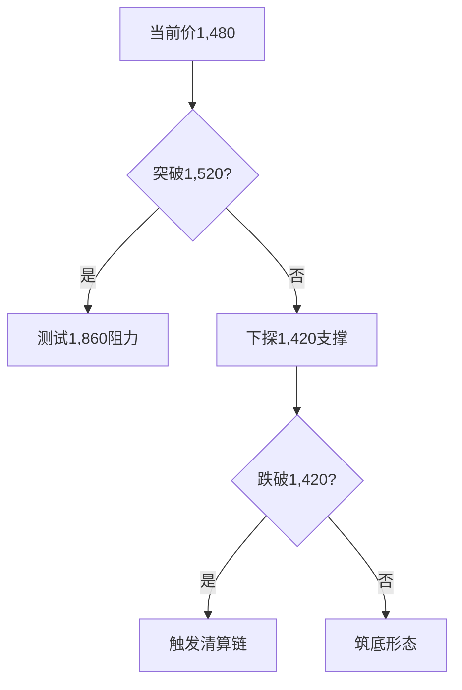

# 4月9日币圈行情速递：比特币、以太坊短线现货合约全解析，牛市熊市一网打尽，新手投资者抱团取暖攻略

## 比特币行情深度解析

### 当前市场数据
- **现价**：74,500美元（日内跌幅5.3%）
- **波动率**：飙升至85%（创2024年减半后新高）
- **关键支撑位**：72,000美元
- **多空分水岭**：78,500美元
- **极端压力位**：68,000美元（周线支撑）

👉 [获取实时行情分析](https://bit.ly/okx_welcome)

### 技术指标警示
| 指标类型 | 当前状态 | 市场含义 |
|---------|----------|---------|
| MACD    | 死叉形态 | 空头主导 |
| KDJ     | 超卖状态 | 短期反弹可能 |
| RSI     | 低于30    | 极端恐慌 |

### 操作策略矩阵
| 策略类型 | 入场条件 | 目标价位 | 止损位 |
|----------|----------|----------|--------|
| 短多修复 | 站稳74,500且RSI突破30 | 76,000 | 73,800 |
| 空头延续 | 4小时收盘跌破72,000 | 68,000 | 74,800 |

#### 市场行为解码
- **巨鲸抄底**：72,000美元处吸筹4,200枚BTC
- **抛压信号**：交易所日净流入量激增至3.1万枚
- **资金费率**：-0.03%显示空头主导短期市场

**FAQ：当前比特币支撑位为何如此关键？**
72,000美元是2023年Q4形成的密集成交区，该价位附近存在大量期权合约，若持续失守可能引发超5亿美元衍生品清算。

---

## 以太坊破局时刻

### 价格动态追踪
- **现价**：1,480美元（创2023年10月以来新低）
- **ETH/BTC汇率**：跌至0.0198历史低位
- **关键支撑**：1,420美元（周线级别）
- **风险阈值**：1,380-1,400美元（质押清算临界区）

👉 [查看以太坊实时数据](https://bit.ly/okx_welcome)

### 技术面三重压力
1. **MACD柱状图**：持续负值且扩大
2. **KDJ死叉**：超卖值达87
3. **RSI背离**：量价出现明显背离

### 双轨操作方案
| 情景 | 策略 | 条件 | 目标区间 |
|------|------|------|----------|
| 反弹做空 | 空头布局 | 反弹至1,520美元 | 1,350美元 |
| 左侧抄底 | 多头入场 | 1,350美元+底背离 | 1,480-1,500美元 |

#### 生态动态影响
- **Pectra升级**：5月7日公布EIP-7732细节
- **Lido风险**：协议准备金率降至89%
- **ETF流动**：单日净流出358万美元

**FAQ：以太坊质押清算风险有多大？**
若价格跌破1,400美元，预计触发约6.75万枚ETH清算（约合10亿美元），可能引发流动性连锁反应。

---

## 新手生存指南

### 风险控制三原则
1. **仓位管理**：单笔风险不超过总资金5%
2. **情绪隔离**：恐慌指数低于30时避免抄底
3. **时间过滤**：规避重大事件前24小时波动

### 市场温度计
| 指标 | 当前值 | 健康区间 |
|------|--------|----------|
| 波动率 | 85%    | 50%-70% |
| 未平仓量变化 | -15%    | ±5%     |
| 交易量 | 持续下降 | 稳定增长  |

**FAQ：新手如何应对极端行情？**
建议采用"观望-分批-对冲"三阶段策略：先用10%资金建立观察仓，突破关键位后逐步加仓，同时用期权对冲黑天鹅风险。

---

## 市场焦点透视

### 关键价位监控
| 币种 | 支撑位1 | 支撑位2 | 阻力位1 | 阻力位2 |
|------|---------|---------|---------|---------|
| BTC  | 72,000  | 68,000  | 76,000  | 78,500  |
| ETH  | 1,420   | 1,350   | 1,520   | 1,860   |

### 资金流动密码
- **BTC巨鲸行为**：72,000美元抄底量达4,200枚
- **ETH清算潮**：6.75万枚ETH被强平
- **资金费率**：BTC -0.03% / ETH -0.05%

👉 [掌握资金流动规律](https://bit.ly/okx_welcome)

**FAQ：如何判断市场底部信号？**
关注三个维度：1）恐慌指数连续3日低于20；2）巨鲸地址持仓增加10%以上；3）期权未平仓量出现"死亡交叉"反转。

---

## 行情推演模型

### 比特币情景分析
| 时间窗口 | 看涨概率 | 看跌概率 | 关键事件 |
|----------|----------|----------|----------|
| 24小时   | 40%      | 60%      | 欧盘波动 |
| 72小时   | 35%      | 65%      | 美联储讲话 |
| 1周      | 50%      | 50%      | 期权交割 |

### 以太坊技术路径

**FAQ：当前为何出现价量齐跌？**
市场处于"三重底"确认期：1）减半效应消退；2）ETF资金流出；3）链上清算潮。建议观察BTC/USDT资金费率是否出现"死亡交叉"反转信号。

---

## 行动清单

### 投资者应对策略
1. **现货持有者**：74,500美元上方持有BTC，1,480美元下方补仓ETH
2. **合约交易者**：78,500美元设空头观察位，1,520美元布局长短仓
3. **套利机会**：关注BTC-ETF溢价与现货价差（当前-0.3%）

### 风险预警系统
- **BTC警戒线**：连续2小时收盘低于72,000美元
- **ETH熔断点**：Lido准备金率跌破85%
- **系统性风险**：加密市场总市值跌破1.5万亿美元

**FAQ：现在适合加仓吗？**
建议采用"金字塔加仓法"：在现有支撑位每下跌5%增加仓位，但总仓位不超过风险承受能力上限的70%。