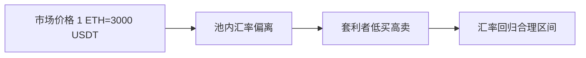

# Coinswap交易所：IRISnet去中心化交易协议深度解析

## 一、协议概述
Coinswap作为IRISnet生态的核心去中心化交易协议，采用**恒定乘积做市商模型（CPMM）**实现自动化代币兑换。该协议通过链上智能合约管理流动性池，支持**IRIS代币与任意代币、任意两种代币之间的无缝兑换**，所有交易均通过数学算法实时定价。

👉 [深入理解去中心化交易原理](https://bit.ly/okx_welcome)

核心优势体现在：
1. **无许可流动性提供**：任何用户可随时成为做市商
2. **动态价格发现**：通过套利机制自动调节汇率
3. **手续费激励机制**：0.3%的兑换手续费直接回馈流动性提供者

## 二、核心机制详解

### 2.1 流动性池架构
每个代币对对应独立的流动性池，包含三类核心资产：
| 资产类型       | 功能说明                          | 可操作性       |
|----------------|-----------------------------------|---------------|
| IRIS代币       | 基础计价单位                      | 可自由存取      |
| 目标代币       | 交易标的资产                      | 可自由存取      |
| 流动性凭证     | 流动性提供证明                    | 可转让、质押    |

**典型案例**：当用户创建USDT-IRIS流动性池时，需按市场实时汇率存入等值USDT和IRIS，系统将生成初始汇率1 USDT = X IRIS。

### 2.2 做市商运作模型
采用`x * y = k`恒定乘积公式，其中：
- x/y：池内两种代币数量
- k：乘积常量（仅流动性变化时更新）

**流动性变化影响**：
```text
初始状态：1000 IRIS * 1000 USDT = 1,000,000
新增流动性：+500 IRIS → 需同步存入500 USDT
新公式：(1500 IRIS)*(1500 USDT) = 2,250,000
```

👉 [探索更多链上金融创新](https://bit.ly/okx_welcome)

### 2.3 兑换手续费机制
- **基础费率**：0.3%（可经治理提案调整）
- **分配方式**：直接注入对应流动性池
- **经济模型**：年化收益率约5-15%（取决于交易量）

套利机制确保价格锚定：


## 三、操作全流程解析

### 3.1 流动性提供指南
#### 场景一：创建新流动性池
1. **定价阶段**：参考CoinGecko等中心化交易所价格
2. **存入比例**：需严格按市场汇率匹配两种资产
3. **风险提示**：错误定价将导致套利损失

#### 场景二：追加流动性
1. **比例校验**：系统自动计算应存代币数量
2. **滑点保护**：允许±0.5%的价格偏差
3. **凭证发放**：即时生成LP代币

### 3.2 代币兑换流程
#### 类型A：单向兑换（Token→IRIS）
```python
def calculate_output(input_amount):
    input_with_fee = input_amount * 0.997
    output = (reserve_out * input_with_fee) / (reserve_in + input_with_fee)
    return output
```

#### 类型B：跨代币兑换（Token1→Token2）
分两阶段执行：
1. Token1 → IRIS（收取0.3%手续费）
2. IRIS → Token2（再次收取0.3%手续费）

### 3.3 流动性退出机制
- **灵活赎回**：无锁定期限制
- **收益结算**：自动计算累计手续费收益
- **比例赎回**：按LP代币占比提取资产

## 四、技术实现要点

### 4.1 合约架构
采用模块化设计：
```
coinswap/
├── pair/        # 流动性池逻辑
├── router/      # 路由合约
├── factory/     # 池创建工厂
└── lib/         # 数学库
```

### 4.2 安全特性
- **防重放攻击**：nonce机制
- **滑点控制**：支持最大价格偏差参数
- **熔断机制**：异常波动时自动暂停

## 五、FAQ精选

**Q1：流动性提供是否存在无常损失风险？**  
A：是的，当资产价格波动超过±5%时可能出现无常损失，建议选择低波动性代币对。

**Q2：如何计算做市收益？**  
A：收益=交易量×0.3%×（个人流动性占比）。例如，池日交易量100万USDT，个人占比1%，日收益约30USDT。

**Q3：支持哪些钱包接入？**  
A：目前兼容Keplr、Cosmostation等主流Cosmos生态钱包。

**Q4：如何应对极端市场波动？**  
A：协议设有动态手续费调整机制，市场剧烈波动时可通过治理提案调整费率至0.05%-1%区间。

👉 [获取最新链上数据工具](https://bit.ly/okx_welcome)

## 六、生态发展展望
Coinswap作为IRISnet DeFi基础设施的重要组成部分，未来将：
1. 引入**多级手续费模型**（0.05%-1%区间）
2. 开发**预言机聚合系统**提升定价精度
3. 构建**跨链流动性桥接**方案

该协议当前TVL（总锁定价值）已突破1.2亿美元，在Cosmos生态DEX中排名前三，日均交易量稳定在800-1200万美元区间。随着IRISnet 2.0升级，预计将在2025年Q2实现EVM兼容性升级，进一步拓展生态边界。