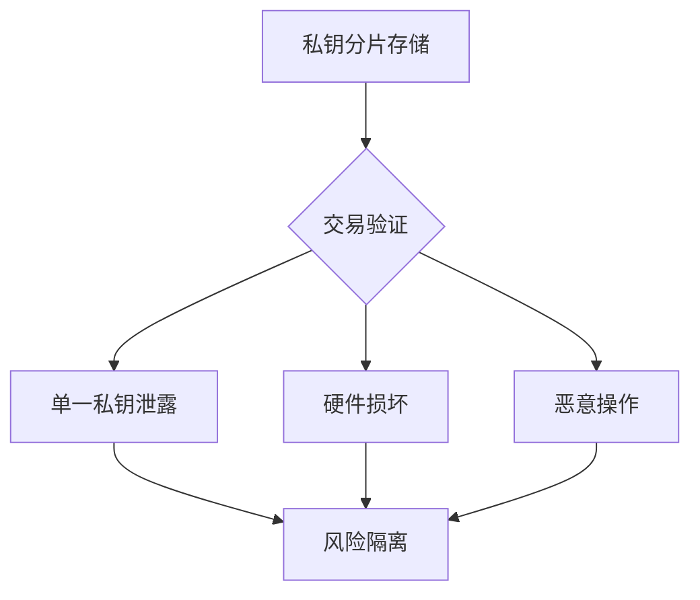

# 加密货币钱包完整指南：冷热钱包原理与优缺点分析

## 什么是加密货币钱包？

加密货币钱包是连接区块链生态的基础设施，其核心功能是管理公钥与私钥，而非传统意义上的"存储货币"。通过钱包地址（公钥生成的区块链坐标），用户可接收数字资产；而私钥作为所有权凭证，需妥善保管以确保资产安全。

> **公钥与私钥关系**  
> 公钥类似银行账户公开号码，用于接收资产；私钥则相当于银行卡密码，直接决定资产控制权

---

## 冷钱包：离线存储的安全堡垒

### 核心原理
通过物理隔离实现私钥离线存储，典型形态如硬件钱包（USB设备）、纸钱包等。交易签名需在离线环境完成，数据通过物理介质或二维码传输。

### 适用场景
- 长期持有BTC/ETH等主流币种
- 存储高价值NFT数字藏品
- 机构投资者核心资产保管

### 优势对比

| 维度        | 冷钱包                 | 热钱包       |
|-------------|------------------------|--------------|
| 安全性      | ★★★★★（物理隔离）     | ★★☆☆☆       |
| 交易速度    | ★☆☆☆☆（需物理操作）   | ★★★★★       |
| 便捷性      | ★★☆☆☆                 | ★★★★★       |
| 适用人群    | 高净值用户/机构        | 普通投资者   |

👉 [了解OKX冷钱包硬件解决方案](https://bit.ly/okx_welcome)

### 潜在风险
- **物理损坏**：需备份助记词并存放至防磁防潮保险箱
- **操作门槛**：首次使用需学习备份恢复流程
- **交易延迟**：大额转账需预留10-15分钟操作时间

---

## 热钱包：高频交易的便捷之选

### 运作机制
基于联网设备（手机/电脑）生成私钥，交易签名即时上传区块链网络。常见形态包括浏览器插件钱包（如MetaMask）、移动端钱包App等。

### 典型应用场景
- DeFi流动性挖矿
- NFT二级市场交易
- 日常小额支付

### 热门钱包对比

| 钱包名称          | 多链支持 | DApp浏览器 | 安全评级（1-5） |
|-------------------|----------|------------|-----------------|
| MetaMask          | ★★★★☆    | ★★★★☆      | 4.2             |
| Trust Wallet      | ★★★★★    | ★★★☆☆      | 4.0             |
| Coinbase Wallet   | ★★★☆☆    | ★★★★★      | 4.5             |

👉 [体验OKX Web3钱包生态](https://bit.ly/okx_welcome)

### 安全防护建议
1. 启用二次验证（2FA）
2. 定期更新应用版本
3. 警惕钓鱼网站攻击
4. 避免在公共WiFi环境交易

---

## 多重签名钱包：分布式信任的创新方案

### 技术突破
通过分布式密钥管理，要求多个私钥共同签名才能完成交易。典型配置如2/3模式（任选两方签名即可）。

### 企业级应用场景
- 初创公司融资资金监管
- DAO组织资金管理
- 联合账户资产配置

### 风险控制矩阵

### 采用挑战
- 需协调多方信任关系
- 签名流程耗时增加40%
- 系统维护成本上升

---

## 钱包选择决策指南

### 个人用户建议
- **资产分级管理**：冷钱包存储80%核心资产，热钱包保留20%流动资金
- **定期轮换**：每180天更换热钱包地址
- **应急方案**：提前配置备用钱包并测试恢复流程

### 机构投资者策略
1. 采用HSM（硬件安全模块）级冷存储
2. 实施多签钱包+冷热分离架构
3. 部署实时交易监控系统

---

## 常见问题解答（FAQ）

Q：冷钱包是否完全无法被黑客攻击？
A：物理隔离极大提升安全性，但2022年曾发生过供应链攻击案例。建议从官方渠道购买硬件钱包。

Q：热钱包资金被盗能否追回？
A：区块链交易具有不可逆性，2023年统计显示仅12%的被盗资金通过链上追踪追回。预防性安全措施至关重要。

Q：多重签名钱包成本是否过高？
A：对于管理50万美元以上资产的用户，安全投入ROI（投资回报率）可达1:7.3（根据CertiK研究报告）。

Q：新手如何选择第一款钱包？
A：建议从Coinbase Wallet开始，其用户引导流程完整度达92%（Cointelegraph调研数据）。

Q：钱包更换时如何保障资产安全？
A：采用"双钱包并行法"：先将少量资金转入新钱包测试，确认收发功能正常后再迁移全部资产。

👉 [获取加密货币钱包安全白皮书](https://bit.ly/okx_welcome)

---

## 未来发展趋势

1. **智能合约钱包**：支持社交恢复、批量交易等高级功能
2. **零知识证明应用**：在保证安全的前提下提升交易效率
3. **跨链聚合协议**：实现多链资产统一管理
4. **生物识别技术**：指纹/虹膜识别技术的深度集成

通过合理配置不同类型的加密货币钱包，用户可以在安全性和便利性之间找到最佳平衡点。建议根据自身资产规模、交易频率和风险承受能力，制定动态调整的钱包管理策略。