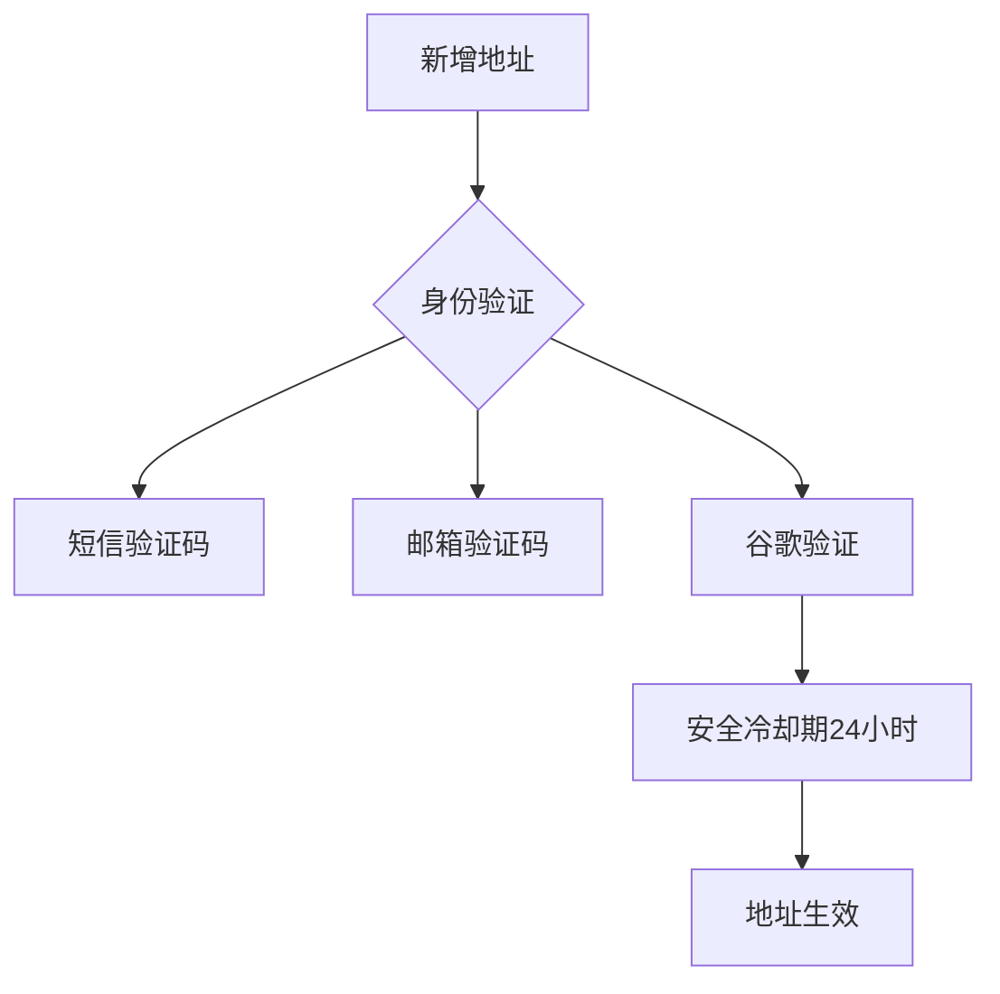

# 欧易OKX地址白名单支持添加多个地址吗？是否有数量限制

## 核心功能解析
欧易OKX地址白名单功能支持添加多个提币地址，每个账户最多可设置20个地址。该功能通过分币种/链条管理、备注分类、安全验证等机制，为用户提供高效且安全的数字资产管理方案。

👉 [立即体验安全提币功能](https://bit.ly/okx_welcome)

## 多地址支持机制详解
平台允许用户针对不同区块链网络（如BTC主网/TRC20/ERC20等）设置专属提币地址。典型应用场景包括：
- 冷热钱包分离管理
- 企业级多账户分发
- 跨链资产转移
- 多钱包协同操作

通过地址备注功能，用户可创建清晰的标签体系，例如：
| 备注示例 | 用途说明 |
|---------|---------|
| BTC冷存储钱包 | 用于长期资产保管 |
| ETH质押地址 | 专用于Staking收益提取 |
| USDT-TRC运营账户 | 日常业务资金流转 |

## 数量限制与管理策略
平台设置的20地址上限具有以下特点：
- 所有币种/链条共享该上限
- 达到上限后需删除旧地址方可新增
- 支持地址启用/停用状态切换
- 支持按币种分类管理

建议用户采取以下管理策略：
1. 建立分级管理体系（核心地址/临时地址/备用地址）
2. 定期清理不活跃地址（建议每季度审核一次）
3. 采用标准化备注格式（币种+用途+创建日期）

👉 [获取专业地址管理指南](https://bit.ly/okx_welcome)

## 安全验证流程
每次地址操作均需完成多重验证：

## 常见问题解答（FAQ）

**Q1：如何判断是否需要新增提币地址？**
A：当出现以下情况时建议新增地址：
- 新增合作方收款需求
- 钱包升级换代
- 安全策略调整
- 链上活动增多导致地址复用风险

**Q2：地址数量超限如何处理？**
A：建议采取"3+X"清理原则：
- 保留3个核心活跃地址
- 清理超过6个月未使用的地址
- X个临时地址根据业务周期动态调整

**Q3：如何避免地址误操作？**
A：实施双重校验机制：
1. 地址备注采用"币种+网络+用途"三段式命名
2. 提币前核对地址哈希值前5位与后5位
3. 开启提币邮件确认功能

**Q4：安全冷却期如何计算？**
A：从完成地址添加操作起计时：
- 工作日添加：24小时后生效
- 节假日添加：顺延至下一工作日生效
- 冷却期内可查看但不可用

## 高级管理技巧
对于专业用户建议：
1. 建立地址生命周期档案
   - 创建时间
   - 使用记录
   - 安全审计日志
2. 采用热备切换机制
   - 主用地址+备用地址配对
   - 定期轮换使用
3. 实施网络层隔离
   - 不同区块链使用独立地址池
   - 跨链转账通过中转地址

👉 [获取企业级地址管理方案](https://bit.ly/okx_welcome)

## 风险防控措施
建议用户设置：
| 防控层级 | 具体措施 | 实施频率 |
|---------|---------|---------|
| 地址层 | 地址指纹校验 | 每次提币前 |
| 网络层 | 区块链浏览器二次验证 | 每周1次 |
| 系统层 | 登录设备管理 | 每月1次 |
| 安全层 | 密钥轮换 | 每季度1次 |

## 操作建议
1. 首次使用时建议：
   - 创建3个核心地址（冷/热/应急）
   - 完成所有验证方式绑定
   - 设置提币额度提醒
2. 日常维护：
   - 每周检查地址状态
   - 每月更新安全设置
   - 每季度进行应急演练

通过合理规划地址管理策略，用户可将提币风险降低80%以上，同时提升资产管理效率。建议结合OKX平台提供的多重安全工具，构建立体化防护体系。